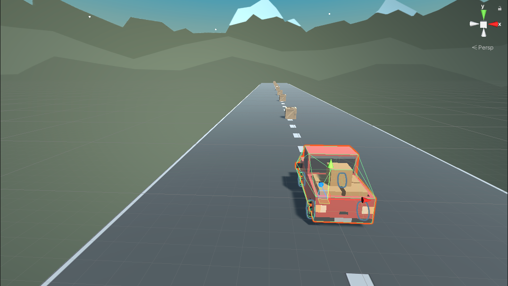

# Basic Driver

This is a project started as part of a [Unity Pathways Couse](https://learn.unity.com/project/unit-1-driving-simulation?missionId=5f71fe63edbc2a00200e9de0&pathwayId=5f7e17e1edbc2a5ec21a20af&contentId=5f7229b2edbc2a001f834db7).

## Covered in Basic Tutorial

The tutorial covered basic camera placement as well as accepting input from WASD keys and translate that to movement.

## Added Features of my own Making

# Roadmap

Checkout the [Todo](./TODO.md) to see what else I have planned for this. Project
